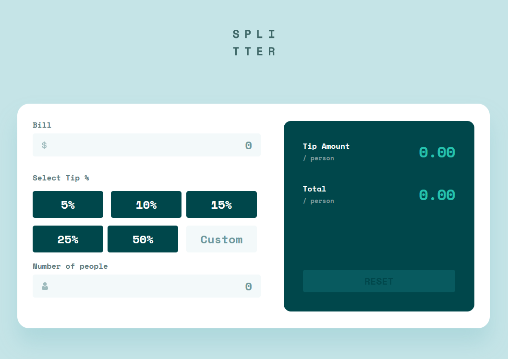

# Splitter
This is a solution to the [Tip calculator app challenge on Frontend Mentor](https://www.frontendmentor.io/challenges/tip-calculator-app-ugJNGbJUX)

## Screenshot

## Usage
1. Enter the total bill amount in the "Bill" field.
2. Select the tip percentage.
3. Enter the number of people who will be splitting the bill in the "Number of people" field.
The Tip Calculator will auto calculate and display the total bill amount, including the tip, and the amount each person should pay.

## Features
- The Tip Calculator allows you to choose from a range of tip percentages, including 10%, 15%, 20%, 25% and a custom amount option.
- You can split the bill evenly among any number of people.

## License

## Links
- Live Site URL: [https://jordanphillips-hub.github.io/Splitter/]

## Built With

- HTML
- CSS
- JavaScript

## Author

- LinkedIn - [https://www.linkedin.com/in/jordan-phillips-/]
- Frontend Mentor - [https://www.frontendmentor.io/profile/JordanPhillips-hub]

